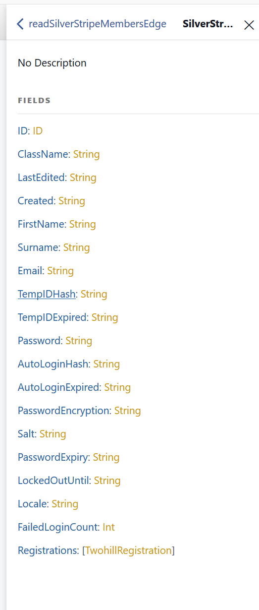

## Example showing graphql issue

In this example, Member is extended with a `has_many` relationship which has subclasses.

We expect the nested query to return a union of all three classes (`Registration`, `GuestRegistration`, and `SpeakerRegistration`) but this doesn't happen

See screenshot
 
 
